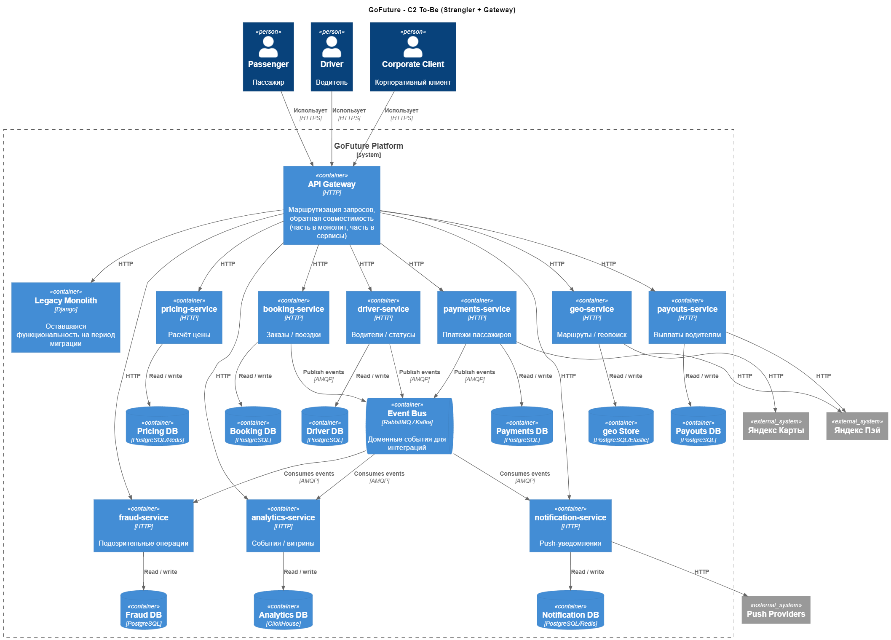

# ADR-001: Пплан доменной декомпозиции GoFuture

## Контекст

GoFuture - такси-агрегатор (пассажирское и водительское приложения + корпоративный портал). Сейчас это монолит на Django с общей PostgreSQL БД, частично async через Celery / RabbitMQ. Бизнес требует рост до 500k конкурентных поездок, 99.95% доступности критичных сценариев, многорегиональное масштабирование, быстрые релизы (до 2 недель) и соблюдение локальной регуляторики.

## Задание

Требуется подготовить:
1. Список нефункциональных требований
2. To‑Be C2 диаграмму сервисов с механизмом обратной совместимости
3. Очередность выделения доменных сервисов с логикой
4. План миграции данных по сервисам с учётом большого объёма и минимизации простоя

## Нефункциональные требования (NFR)

1. Доступность 99.95% для критических пользовательских сценариев (заказ / поездка / оплата)
2. Масштабируемость - до 500k конкурентных поездок. Горизонтальное масштабирование по сервисам
3. Одновременная работа в разных регионах
4. Предотвращение каскадных отказов
5. Наблюдаемость - централизованные логи / метрики / трейсинг, корреляция `request_id`
6. Регуляторика - data residency / retention и возможность раздельного хранения по регионам
7. Обратная совместимость на период миграции
8. Независимые релизы сервисов, CI/CD, уменьшение времени сборки / деплоя
9. Контроль затрат (FinOps), авто‑скейлинг, лимиты по сервисам

## To-be диаграмма сервисов и механизм обратной совместимости

Обратная совместимость обеспечивается:

- Единая точка входа для mobile / web - **API Gateway**. Маршрутизация части эндпоинтов в монолит, часть - в новые сервисы
- Миграция выполняется следуя принципу **Strangler Fig** - сначала закрываем монолит гейтвеем, затем постепенно выделяем домены в отдельные сервисы
- Между монолитом и новыми сервисами добавялем **ACL**, новые сервисы не тянут внутренние модели монолита

## Очерёдность выделения сервисов (~ на год)

Начинаем с наиболее изолированных / безопасных доменов и базовой платформенной обвязки (gateway / наблюдаемость), затем выносим высоконагруженные и бизнес-критичные куски.

1. **API Gateway** - чтобы миграция была управляемой и откатываемой
2. **notification-service** - достаточно автономен, уменьшает нагрузку на монолит. Не критический компонент - безопасен для первого выноса, позволяет отработать процесс миграции, проверить наблюдаемость и CI/CD
3. **pricing-service** - даёт быстрый бизнес-эффект (динамическое ценообразование)
4. **payments-service** + **payouts-service** - критичные по деньгам сервисы
5. Остальные сервисы: **geo-service**, **fraud-service**, **driver-service**
6. **booking-service** - самый связанный домен, когда всё остальное уже перенесено

## План миграции данных

1. Выбор и создание БД сервиса, схема, индексы, ACL, настройка мониторинга
2. Перенос исторических данных из монолитной БД в новую
3. Синхронизация изменений через outbox в монолите (временно ДБ дублируют друг друга)
4. Переключение чтения / записи через Gateway на сервис. В монолите данные становятся read-only для сверки
5. Архивация / удаление старых БД после периода гарантии и сверок

## Альтернативы

- Переписать сразу весь монолит на новые сервисы и переключить на них - приведёт к большому взрыву - слишком высокий риск регрессий и простоя

## Компромиссы / риски

- Переходный период усложняет систему (gateway + ACL + дублирование ДБ)
- Для критически важных сервисов (payments / payouts) обязательны сверки данных после миграции
- Асинхронное взаимодействие и eventual consistency усложняют бизнес-процессы и мониторинг, требуется явная проработка компенсаций / Saga
